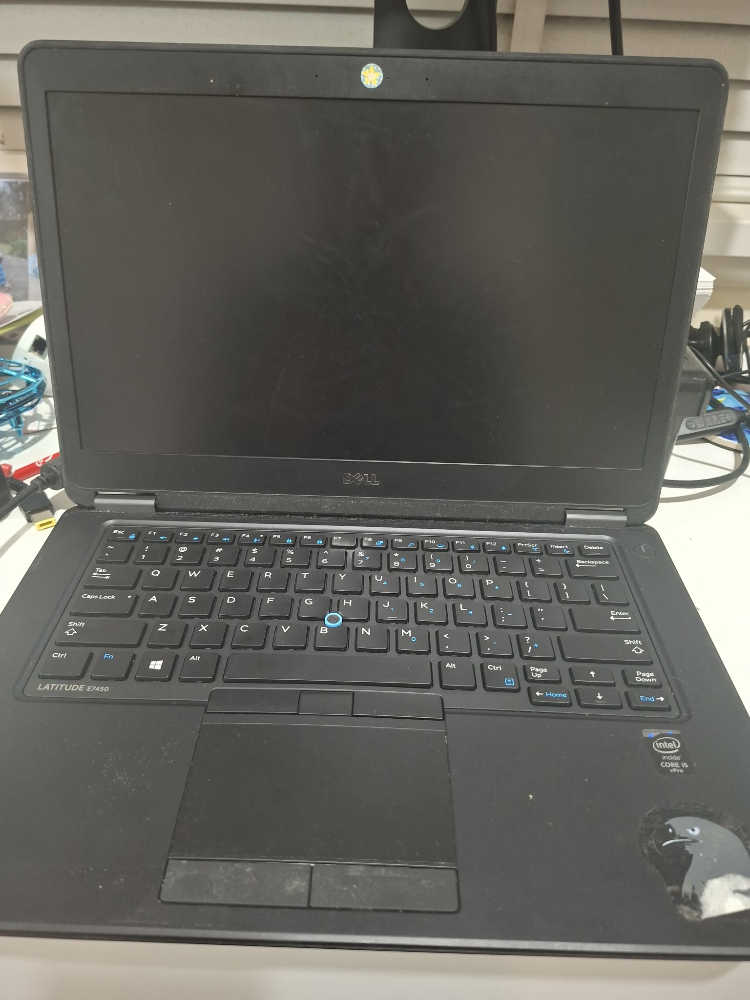
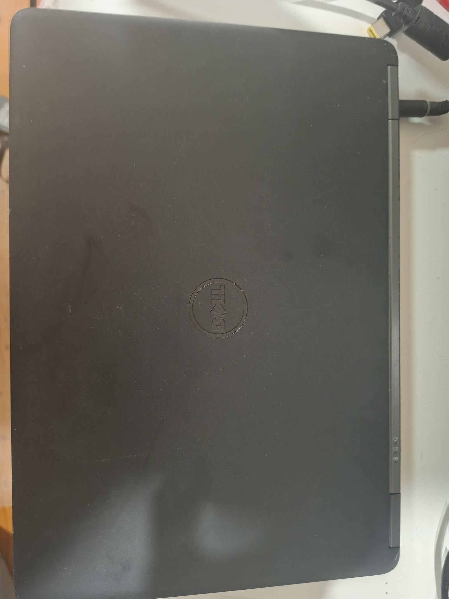

# Experiment 001: Reviving an Old Laptop

**Status:** 🟡 Initial Block Download (**71.78% Complete**)
**Last Updated:** July 23, 2026

---

# Experiment Summary

| Item             | Details                                                 |
| ---------------- | ------------------------------------------------------- |
| Experiment       | Reviving an Old Laptop                                  |
| Goal             | Build useful home infrastructure from existing hardware |
| Hardware         | Dell Latitude E7450                                     |
| Operating System | Ubuntu Server 26.04 LTS                                 |
| Software         | Bitcoin Core 31.0                                       |
| Node Type        | Pruned Bitcoin Node                                     |
| Storage Target   | 10 GB prune limit                                       |
| Project Cost     | $0                                                      |
| Status           | Initial Block Download (71.78%)                         |

---

## Goal

Can an old laptop become useful sovereign home infrastructure?

The first ProofOfHome experiment explores whether existing hardware can be transformed into a Bitcoin home node using free and open-source software.

Rather than buying specialised hardware, this experiment documents what can be achieved by repurposing equipment that would otherwise sit unused.

The process documents:

* Setup
* Costs
* Challenges
* Performance
* Power usage
* Lessons learned

---

## Why This Experiment?

Thousands of computers are replaced every year despite still having useful life remaining.

This experiment starts with a simple question:

> **Can existing hardware still provide meaningful infrastructure in a modern home?**

Rather than focusing on the newest hardware, ProofOfHome begins by exploring what can be built using equipment that many people already have.

---

# Starting Hardware

## Dell Latitude E7450

* Intel Core i5-5300U @ 2.30 GHz
* 8 GB RAM
* 128 GB mSATA SSD
* Battery health: 94%

---

## Photos

---

# History

This laptop originally ran Windows 7 before being retired.

Instead of becoming electronic waste, it is being given a second life as the first ProofOfHome infrastructure project.

The aim is not to prove old hardware is always the best option, but to test whether existing equipment can still provide useful infrastructure with little or no financial cost.

---

# Current Status

The laptop has successfully been transformed into an Ubuntu Server system running Bitcoin Core as a **pruned Bitcoin node**.

The node is currently performing its **Initial Block Download (IBD)**, downloading and verifying the Bitcoin blockchain before entering normal operation.

## Completed

* Ubuntu Server 26.04 LTS installed
* Dell UEFI boot issues resolved
* Wi-Fi configured
* System updated
* Monitoring tools installed
* Bitcoin Core 31.0 installed
* SHA256 checksum verified
* GPG release signature verified
* Pruned node configured
* Bitcoin Core daemon started
* Initial blockchain synchronisation reached **71.78%**

## Next

* Complete blockchain synchronisation
* Record total synchronisation time
* Measure CPU usage
* Measure RAM usage
* Measure power consumption
* Publish final results

---

# Baseline Measurements

## Hardware

* CPU: Intel Core i5-5300U @ 2.30 GHz
* RAM: 8 GB
* Storage: 128 GB SSD
* Battery health: 94%

## Software

* Ubuntu Server 26.04 LTS
* Bitcoin Core 31.0
* htop
* lm-sensors
* smartmontools

---

# Bitcoin Core Installation

## July 18, 2026

Bitcoin Core was installed using the official Linux binaries.

### Verification

* SHA256 checksum verified
* Official GPG release signature verified

### Configuration

* Bitcoin Core 31.0
* Ubuntu Server 26.04 LTS
* Pruned node
* Automatic pruning enabled
* 10 GB storage target

### Result

Bitcoin Core successfully started and began synchronising with the Bitcoin network.

---

# Synchronisation Progress

The node is currently performing its **Initial Block Download (IBD)**.

The checkpoints below document synchronisation progress over time.

| Date      | Verification | Blocks Validated | Prune Height | Disk Usage | Notes                                                                                                                                   |
| --------- | -----------: | ---------------: | -----------: | ---------: | --------------------------------------------------------------------------------------------------------------------------------------- |
| July 2026 |       21.96% |          494,647 |            — |    3.41 GB | Initial synchronisation after Bitcoin Core installation.                                                                                |
| July 2026 |       50.66% |          717,597 |      716,420 |    2.07 GB | Approximately halfway through blockchain verification. Pruning operating as expected.                                                   |
| July 2026 |       71.78% |          840,562 |      838,773 |    4.09 GB | Synchronisation progressing steadily. Automatic pruning continues to reclaim storage while remaining below the configured 10 GB target. |

## Latest Update

The node has now validated **more than 840,000 blocks** and continues synchronising with the Bitcoin network.

One interesting observation during this stage is how **pruning dynamically manages storage**. As older validated blocks become unnecessary, Bitcoin Core automatically removes them while keeping the node fully validated.

At the latest checkpoint:

* Verification progress reached **71.78%**
* Block **840,562** had been fully validated
* Prune height advanced to **838,773**
* Disk usage remained at **4.09 GB**, well below the configured storage target

This demonstrates how a pruned Bitcoin node can perform full validation without permanently storing the entire blockchain.

---

# Challenges

## Dell UEFI Boot Configuration

The laptop initially required troubleshooting before it would boot correctly from the Ubuntu Server installer.

## Ubuntu Server Network Configuration

Wi-Fi configuration required troubleshooting due to YAML configuration errors.

## Initial Blockchain Synchronisation

Running a Bitcoin node on older hardware requires patience. The Initial Block Download is expected to take several days and is the most time-consuming part of the experiment.

---

# Timeline

## July 17, 2026

Completed:

* Ubuntu Server installed
* Dell UEFI boot issue resolved
* Wi-Fi configured
* Monitoring tools installed

---

## July 18, 2026

Completed:

* Downloaded official Bitcoin Core binaries
* Verified SHA256 checksum
* Verified GPG signature
* Installed Bitcoin Core 31.0
* Configured pruned node
* Started Bitcoin Core daemon

---

## July 21, 2026

Milestone reached:

* 717,597 blocks validated
* 50.66% verification complete
* Prune height reached 716,420
* Disk usage 2.07 GB

---

## July 23, 2026

Milestone reached:

* 840,562 blocks validated
* Verification progress reached 71.78%
* Prune height advanced to 838,773
* Disk usage remained below the configured storage target
* Initial Block Download continues

---

# Costs

| Item                   |     Cost |
| ---------------------- | -------: |
| Dell Latitude E7450    |       $0 |
| Existing charger       |       $0 |
| Kingston USB installer | Existing |
| Ubuntu Server          |       $0 |
| Bitcoin Core           |       $0 |

## Total Project Cost

**$0**

---

# Metrics To Record

| Metric                     | Result  |
| -------------------------- | ------- |
| Total synchronisation time | Pending |
| Final blockchain height    | Pending |
| Final disk usage           | Pending |
| Average CPU usage          | Pending |
| Peak RAM usage             | Pending |
| Power consumption          | Pending |
| Long-term reliability      | Pending |

---

# Lessons Learned

To be completed once the experiment concludes.

---

# Would I Do This Again?

**Pending completion**

| Category       | Rating  |
| -------------- | ------- |
| Cost           | Pending |
| Difficulty     | Pending |
| Time Required  | Pending |
| Performance    | Pending |
| Recommendation | Pending |

---

# Results

**Experiment in progress.**

The final report will include:

* Total blockchain synchronisation time
* Resource usage
* Power consumption
* Storage utilisation
* Long-term reliability
* Overall recommendation
* Lessons learned

---

# Appendix

Commands, configuration files and troubleshooting notes will be documented here to make the experiment reproducible.
